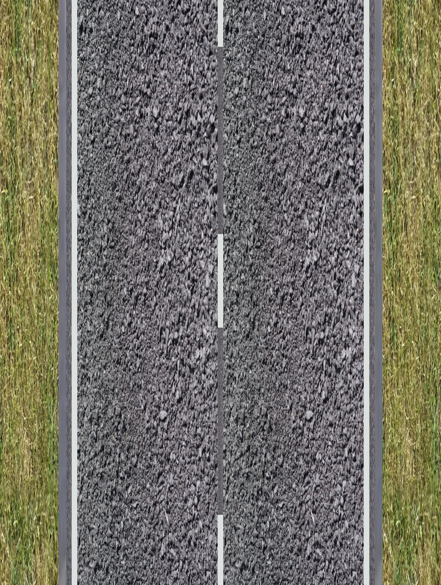

<table>
    <tr>
        <th></th>
        <th>Way A</th>
        <th>Way B</th>
        <th>Way C</th>
    </tr>
    <tr>
        <td></td>
        <td><table>
            <tr><td style="text-align: right"><code>highway</code></td><td><code>road</code></td></tr>
            <tr><td style="text-align: right"><code>cycleway:both</code></td><td><code>no</code></td></tr>
            <tr><td style="text-align: right"><code>sidewalk:both</code></td><td><code>no</code></td></tr>
        </table></td>
        <td><table>
            <tr><td></td></tr>
        </table></td>
        <td><table>
            <tr><td></td></tr>
        </table></td>
    </tr>
    <tr>
        <td></td>
        <td><table>
            <tr><td style="text-align: right"><code>highway</code></td><td><code>road</code></td></tr>
            <tr><td style="text-align: right"><code>cycleway:both</code></td><td><code>no</code></td></tr>
            <tr><td style="text-align: right"><code>sidewalk:left</code></td><td><code>no</code></td></tr>
            <tr><td style="text-align: right"><code>sidewalk:right</code></td><td><code>separate</code></td></tr>
        </table></td>
        <td><table>
            <tr><td style="text-align: right"><code>highway</code></td><td><code>footway</code></td></tr>
            <tr><td style="text-align: right"><code>footway</code></td><td><code>sidewalk</code></td></tr>
        </table></td>
        <td><table>
            <tr><td></td></tr>
        </table></td>
    </tr>
    <tr>
        <td></td>
        <td><table>
            <tr><td style="text-align: right"><code>highway</code></td><td><code>road</code></td></tr>
            <tr><td style="text-align: right"><code>cycleway:left</code></td><td><code>no</code></td></tr>
            <tr><td style="text-align: right"><code>cycleway:right</code></td><td><code>separate</code></td></tr>
            <tr><td style="text-align: right"><code>bicycle:right</code></td><td><code>optional_sidepath</code></td></tr>
            <tr><td style="text-align: right"><code>sidewalk:left</code></td><td><code>no</code></td></tr>
            <tr><td style="text-align: right"><code>sidewalk:right</code></td><td><code>separate</code></td></tr>
        </table></td>
        <td><table>
            <tr><td style="text-align: right"><code>highway</code></td><td><code>footway</code></td></tr>
            <tr><td style="text-align: right"><code>footway</code></td><td><code>sidewalk</code></td></tr>
            <tr><td style="text-align: right"><code>foot</code></td><td><code>designated</code></td></tr>
            <tr><td style="text-align: right"><code>bicycle</code></td><td><code>yes</code></td></tr>
            <tr><td style="text-align: right"><code>maxspeed:bicycle</code></td><td><code>walk</code></td></tr>
            <tr><td style="text-align: right"><code>traffic_sign</code></td><td><code>DE:239;1022-10</code></td></tr>
        </table></td>
        <td><table>
            <tr><td></td></tr>
        </table></td>
    </tr>
    <tr>
        <td></td>
        <td><table>
            <tr><td style="text-align: right"><code>highway</code></td><td><code>road</code></td></tr>
            <tr><td style="text-align: right"><code>cycleway:left</code></td><td><code>no</code></td></tr>
            <tr><td style="text-align: right"><code>cycleway:right</code></td><td><code>lane</code></td></tr>
            <tr><td style="text-align: right"><code>cycleway:right:lane</code></td><td><code>advisory</code></td></tr>
            <tr><td style="text-align: right"><code>cycleway:right:lane:bicycle</code></td><td><code>yes</code></td></tr>
            <tr><td style="text-align: right"><code>sidewalk:left</code></td><td><code>no</code></td></tr>
            <tr><td style="text-align: right"><code>sidewalk:right</code></td><td><code>separate</code></td></tr>
        </table></td>
        <td><table>
            <tr><td style="text-align: right"><code>highway</code></td><td><code>footway</code></td></tr>
            <tr><td style="text-align: right"><code>footway</code></td><td><code>sidewalk</code></td></tr>
        </table></td>
        <td><table>
            <tr><td></td></tr>
        </table></td>
    </tr>
    <tr>
        <td></td>
        <td><table>
            <tr><td style="text-align: right"><code>highway</code></td><td><code>road</code></td></tr>
            <tr><td style="text-align: right"><code>lanes</code></td><td><code>2</code></td></tr>
            <tr><td style="text-align: right"><code>cycleway:left</code></td><td><code>no</code></td></tr>
            <tr><td style="text-align: right"><code>cycleway:right</code></td><td><code>lane</code></td></tr>
            <tr><td style="text-align: right"><code>cycleway:right:lane</code></td><td><code>advisory</code></td></tr>
            <tr><td style="text-align: right"><code>cycleway:right:lane:bicycle</code></td><td><code>yes</code></td></tr>
            <tr><td style="text-align: right"><code>sidewalk:left</code></td><td><code>no</code></td></tr>
            <tr><td style="text-align: right"><code>sidewalk:right</code></td><td><code>separate</code></td></tr>
        </table></td>
        <td><table>
            <tr><td style="text-align: right"><code>highway</code></td><td><code>footway</code></td></tr>
            <tr><td style="text-align: right"><code>footway</code></td><td><code>sidewalk</code></td></tr>
        </table></td>
        <td><table>
            <tr><td></td></tr>
        </table></td>
    </tr>
    <tr>
        <td></td>
        <td><table>
            <tr><td style="text-align: right"><code>highway</code></td><td><code>road</code></td></tr>
            <tr><td style="text-align: right"><code>lanes</code></td><td><code>2</code></td></tr>
            <tr><td style="text-align: right"><code>cycleway:left</code></td><td><code>no</code></td></tr>
            <tr><td style="text-align: right"><code>cycleway:right</code></td><td><code>lane</code></td></tr>
            <tr><td style="text-align: right"><code>cycleway:right:lane</code></td><td><code>exclusive</code></td></tr>
            <tr><td style="text-align: right"><code>cycleway:right:lane:bicycle</code></td><td><code>designated</code></td></tr>
            <tr><td style="text-align: right"><code>sidewalk:left</code></td><td><code>no</code></td></tr>
            <tr><td style="text-align: right"><code>sidewalk:right</code></td><td><code>separate</code></td></tr>
        </table></td>
        <td><table>
            <tr><td style="text-align: right"><code>highway</code></td><td><code>footway</code></td></tr>
            <tr><td style="text-align: right"><code>footway</code></td><td><code>sidewalk</code></td></tr>
        </table></td>
        <td><table>
            <tr><td></td></tr>
        </table></td>
    </tr>
    <tr>
        <td></td>
        <td><table>
            <tr><td style="text-align: right"><code>highway</code></td><td><code>road</code></td></tr>
            <tr><td style="text-align: right"><code>cycleway:left</code></td><td><code>no</code></td></tr>
            <tr><td style="text-align: right"><code>sidewalk:left</code></td><td><code>no</code></td></tr>
            <tr><td style="text-align: right"><code>cycleway:right</code></td><td><code>separate</code></td></tr>
            <tr><td style="text-align: right"><code>bicycle:right</code></td><td><code>use_sidepath</code></td></tr>
            <tr><td style="text-align: right"><code>sidewalk:right</code></td><td><code>separate</code></td></tr>
        </table></td>
        <td><table>
            <tr><td style="text-align: right"><code>highway</code></td><td><code>path</code></td></tr>
            <tr><td style="text-align: right"><code>footway</code></td><td><code>sidewalk</code></td></tr>
            <tr><td style="text-align: right"><code>foot</code></td><td><code>designated</code></td></tr>
            <tr><td style="text-align: right"><code>bicycle</code></td><td><code>designated</code></td></tr>
            <tr><td style="text-align: right"><code>segregated</code></td><td><code>no</code></td></tr>
            <tr><td style="text-align: right"><code>traffic_sign</code></td><td><code>DE:240</code></td></tr>
        </table></td>
        <td><table>
            <tr><td></td></tr>
        </table></td>
    </tr>
    <tr>
        <td></td>
        <td><table>
            <tr><td style="text-align: right"><code>highway</code></td><td><code>road</code></td></tr>
            <tr><td style="text-align: right"><code>cycleway:right</code></td><td><code>separate</code></td></tr>
            <tr><td style="text-align: right"><code>bicycle:right</code></td><td><code>optional_sidepath</code></td></tr>
            <tr><td style="text-align: right"><code>sidewalk:right</code></td><td><code>separate</code></td></tr>
            <tr><td style="text-align: right"><code>cycleway:left</code></td><td><code>no</code></td></tr>
            <tr><td style="text-align: right"><code>sidewalk:left</code></td><td><code>no</code></td></tr>
        </table></td>
        <td><table>
            <tr><td style="text-align: right"><code>highway</code></td><td><code>path</code></td></tr>
            <tr><td style="text-align: right"><code>bicycle</code></td><td><code>yes</code></td></tr>
            <tr><td style="text-align: right"><code>bicycle:oneway</code></td><td><code>yes</code></td></tr>
            <tr><td style="text-align: right"><code>foot</code></td><td><code>designated</code></td></tr>
            <tr><td style="text-align: right"><code>footway</code></td><td><code>sidewalk</code></td></tr>
            <tr><td style="text-align: right"><code>segregated</code></td><td><code>yes</code></td></tr>
        </table></td>
        <td><table>
            <tr><td></td></tr>
        </table></td>
    </tr>
    <tr>
        <td></td>
        <td><table>
            <tr><td style="text-align: right"><code>highway</code></td><td><code>road</code></td></tr>
            <tr><td style="text-align: right"><code>cycleway:right</code></td><td><code>separate</code></td></tr>
            <tr><td style="text-align: right"><code>bicycle:right</code></td><td><code>use_sidepath</code></td></tr>
            <tr><td style="text-align: right"><code>sidewalk:right</code></td><td><code>separate</code></td></tr>
            <tr><td style="text-align: right"><code>cycleway:left</code></td><td><code>no</code></td></tr>
            <tr><td style="text-align: right"><code>sidewalk:left</code></td><td><code>no</code></td></tr>
        </table></td>
        <td><table>
            <tr><td style="text-align: right"><code>highway</code></td><td><code>path</code></td></tr>
            <tr><td style="text-align: right"><code>bicycle</code></td><td><code>designated</code></td></tr>
            <tr><td style="text-align: right"><code>bicycle:oneway</code></td><td><code>yes</code></td></tr>
            <tr><td style="text-align: right"><code>foot</code></td><td><code>designated</code></td></tr>
            <tr><td style="text-align: right"><code>footway</code></td><td><code>sidewalk</code></td></tr>
            <tr><td style="text-align: right"><code>segregated</code></td><td><code>yes</code></td></tr>
            <tr><td style="text-align: right"><code>traffic_sign</code></td><td><code>DE:241-30</code></td></tr>
        </table></td>
        <td><table>
            <tr><td></td></tr>
        </table></td>
    </tr>
    <tr>
        <td></td>
        <td><table>
            <tr><td style="text-align: right"><code>highway</code></td><td><code>road</code></td></tr>
            <tr><td style="text-align: right"><code>cycleway:right</code></td><td><code>separate</code></td></tr>
            <tr><td style="text-align: right"><code>bicycle:right</code></td><td><code>optional_sidepath</code></td></tr>
            <tr><td style="text-align: right"><code>sidewalk:right</code></td><td><code>separate</code></td></tr>
            <tr><td style="text-align: right"><code>cycleway:left</code></td><td><code>no</code></td></tr>
            <tr><td style="text-align: right"><code>sidewalk:left</code></td><td><code>no</code></td></tr>
        </table></td>
        <td><table>
            <tr><td style="text-align: right"><code>highway</code></td><td><code>cycleway</code></td></tr>
            <tr><td style="text-align: right"><code>bicycle</code></td><td><code>yes</code></td></tr>
            <tr><td style="text-align: right"><code>bicycle:oneway</code></td><td><code>yes</code></td></tr>
        </table></td>
        <td><table>
            <tr><td style="text-align: right"><code>highway</code></td><td><code>footway</code></td></tr>
            <tr><td style="text-align: right"><code>footway</code></td><td><code>sidewalk</code></td></tr>
        </table></td>
    </tr>
    <tr>
        <td></td>
        <td><table>
            <tr><td style="text-align: right"><code>highway</code></td><td><code>road</code></td></tr>
            <tr><td style="text-align: right"><code>cycleway:right</code></td><td><code>separate</code></td></tr>
            <tr><td style="text-align: right"><code>bicycle:right</code></td><td><code>use_sidepath</code></td></tr>
            <tr><td style="text-align: right"><code>sidewalk:right</code></td><td><code>separate</code></td></tr>
            <tr><td style="text-align: right"><code>cycleway:left</code></td><td><code>no</code></td></tr>
            <tr><td style="text-align: right"><code>sidewalk:left</code></td><td><code>no</code></td></tr>
        </table></td>
        <td><table>
            <tr><td style="text-align: right"><code>highway</code></td><td><code>cycleway</code></td></tr>
            <tr><td style="text-align: right"><code>bicycle</code></td><td><code>designated</code></td></tr>
            <tr><td style="text-align: right"><code>bicycle:oneway</code></td><td><code>yes</code></td></tr>
            <tr><td style="text-align: right"><code>traffic_sign</code></td><td><code>DE:237</code></td></tr>
        </table></td>
        <td><table>
            <tr><td style="text-align: right"><code>highway</code></td><td><code>footway</code></td></tr>
            <tr><td style="text-align: right"><code>footway</code></td><td><code>sidewalk</code></td></tr>
        </table></td>
    </tr>
    <tr>
        <td></td>
        <td><table>
            <tr><td style="text-align: right"><code>highway</code></td><td><code>road</code></td></tr>
            <tr><td style="text-align: right"><code>cycleway:right</code></td><td><code>separate</code></td></tr>
            <tr><td style="text-align: right"><code>bicycle:both</code></td><td><code>use_sidepath</code></td></tr>
            <tr><td style="text-align: right"><code>sidewalk:right</code></td><td><code>separate</code></td></tr>
            <tr><td style="text-align: right"><code>cycleway:left</code></td><td><code>no</code></td></tr>
            <tr><td style="text-align: right"><code>sidewalk:left</code></td><td><code>no</code></td></tr>
        </table></td>
        <td><table>
            <tr><td style="text-align: right"><code>highway</code></td><td><code>cycleway</code></td></tr>
            <tr><td style="text-align: right"><code>bicycle</code></td><td><code>designated</code></td></tr>
            <tr><td style="text-align: right"><code>bicycle:oneway</code></td><td><code>no</code></td></tr>
            <tr><td style="text-align: right"><code>traffic_sign</code></td><td><code>DE:237;1000-31</code></td></tr>
        </table></td>
        <td><table>
            <tr><td style="text-align: right"><code>highway</code></td><td><code>footway</code></td></tr>
            <tr><td style="text-align: right"><code>footway</code></td><td><code>sidewalk</code></td></tr>
        </table></td>
    </tr>
    <tr>
        <td></td>
        <td><table>
            <tr><td style="text-align: right"><code>highway</code></td><td><code>road</code></td></tr>
            <tr><td style="text-align: right"><code>cycleway:right</code></td><td><code>separate</code></td></tr>
            <tr><td style="text-align: right"><code>bicycle:both</code></td><td><code>use_sidepath</code></td></tr>
            <tr><td style="text-align: right"><code>sidewalk:right</code></td><td><code>separate</code></td></tr>
            <tr><td style="text-align: right"><code>cycleway:left</code></td><td><code>no</code></td></tr>
            <tr><td style="text-align: right"><code>sidewalk:left</code></td><td><code>no</code></td></tr>
        </table></td>
        <td><table>
            <tr><td style="text-align: right"><code>highway</code></td><td><code>path</code></td></tr>
            <tr><td style="text-align: right"><code>bicycle</code></td><td><code>designated</code></td></tr>
            <tr><td style="text-align: right"><code>foot</code></td><td><code>designated</code></td></tr>
            <tr><td style="text-align: right"><code>bicycle:oneway</code></td><td><code>no</code></td></tr>
            <tr><td style="text-align: right"><code>segregated</code></td><td><code>yes</code></td></tr>
            <tr><td style="text-align: right"><code>footway</code></td><td><code>sidewalk</code></td></tr>
            <tr><td style="text-align: right"><code>traffic_sign</code></td><td><code>DE:241;1000-31</code></td></tr>
        </table></td>
        <td><table>
            <tr><td></td></tr>
        </table></td>
    </tr>
    <tr>
        <td></td>
        <td><table>
            <tr><td style="text-align: right"><code>highway</code></td><td><code>road</code></td></tr>
            <tr><td style="text-align: right"><code>cycleway:right</code></td><td><code>separate</code></td></tr>
            <tr><td style="text-align: right"><code>bicycle:right</code></td><td><code>optional_sidepath</code></td></tr>
            <tr><td style="text-align: right"><code>sidewalk:right</code></td><td><code>separate</code></td></tr>
            <tr><td style="text-align: right"><code>cycleway:left</code></td><td><code>no</code></td></tr>
            <tr><td style="text-align: right"><code>sidewalk:left</code></td><td><code>no</code></td></tr>
        </table></td>
        <td><table>
            <tr><td style="text-align: right"><code>highway</code></td><td><code>cycleway</code></td></tr>
            <tr><td style="text-align: right"><code>bicycle</code></td><td><code>yes</code></td></tr>
            <tr><td style="text-align: right"><code>bicycle:oneway</code></td><td><code>yes</code></td></tr>
        </table></td>
        <td><table>
            <tr><td style="text-align: right"><code>highway</code></td><td><code>footway</code></td></tr>
            <tr><td style="text-align: right"><code>footway</code></td><td><code>sidewalk</code></td></tr>
        </table></td>
    </tr>
    <tr>
        <td></td>
        <td><table>
            <tr><td style="text-align: right"><code>highway</code></td><td><code>road</code></td></tr>
            <tr><td style="text-align: right"><code>cycleway:right</code></td><td><code>separate</code></td></tr>
            <tr><td style="text-align: right"><code>bicycle:right</code></td><td><code>use_sidepath</code></td></tr>
            <tr><td style="text-align: right"><code>sidewalk:right</code></td><td><code>separate</code></td></tr>
            <tr><td style="text-align: right"><code>cycleway:left</code></td><td><code>no</code></td></tr>
            <tr><td style="text-align: right"><code>sidewalk:left</code></td><td><code>no</code></td></tr>
        </table></td>
        <td><table>
            <tr><td style="text-align: right"><code>highway</code></td><td><code>cycleway</code></td></tr>
            <tr><td style="text-align: right"><code>bicycle</code></td><td><code>designated</code></td></tr>
            <tr><td style="text-align: right"><code>bicycle:oneway</code></td><td><code>yes</code></td></tr>
            <tr><td style="text-align: right"><code>traffic_sign</code></td><td><code>DE:237</code></td></tr>
        </table></td>
        <td><table>
            <tr><td style="text-align: right"><code>highway</code></td><td><code>footway</code></td></tr>
            <tr><td style="text-align: right"><code>footway</code></td><td><code>sidewalk</code></td></tr>
        </table></td>
    </tr>
    <tr>
        <td></td>
        <td><table>
            <tr><td style="text-align: right"><code>highway</code></td><td><code>road</code></td></tr>
            <tr><td style="text-align: right"><code>cycleway:right</code></td><td><code>separate</code></td></tr>
            <tr><td style="text-align: right"><code>bicycle:both</code></td><td><code>use_sidepath</code></td></tr>
            <tr><td style="text-align: right"><code>sidewalk:right</code></td><td><code>separate</code></td></tr>
            <tr><td style="text-align: right"><code>cycleway:left</code></td><td><code>no</code></td></tr>
            <tr><td style="text-align: right"><code>sidewalk:left</code></td><td><code>no</code></td></tr>
        </table></td>
        <td><table>
            <tr><td style="text-align: right"><code>highway</code></td><td><code>cycleway</code></td></tr>
            <tr><td style="text-align: right"><code>bicycle</code></td><td><code>designated</code></td></tr>
            <tr><td style="text-align: right"><code>bicycle:oneway</code></td><td><code>no</code></td></tr>
            <tr><td style="text-align: right"><code>traffic_sign</code></td><td><code>DE:237;1000-31</code></td></tr>
        </table></td>
        <td><table>
            <tr><td style="text-align: right"><code>highway</code></td><td><code>footway</code></td></tr>
            <tr><td style="text-align: right"><code>footway</code></td><td><code>sidewalk</code></td></tr>
        </table></td>
    </tr>
</table>